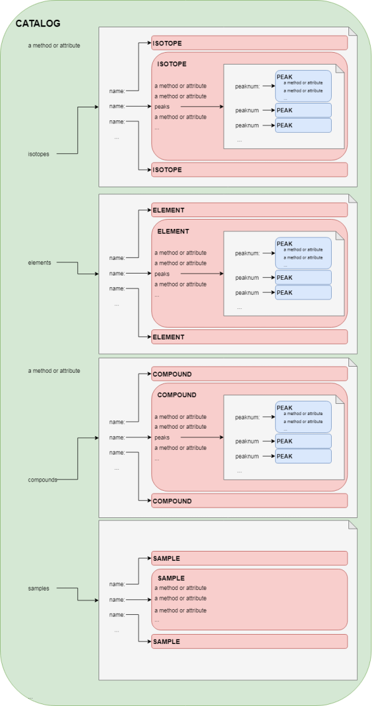
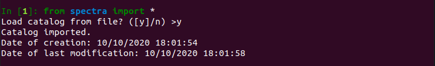
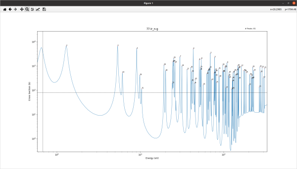

# NRCA-Spectra

Last revision: October 2020.

This is a program written by Ivan Alsina Ferrer (ivanalsinaferrer@gmail.com) during a summer internship at STFC (Oxfordshire, UK) on the period Jun-Aug 2019.

It intends to create a database of spectra that stores information on each needed **`Isotope`**, is able to weight them to create **`Element`**s and **`Compound`**s, and stores **`Sample`** spectra from the INES instrument at STFC. It also includes some functions that help import data, weigh it, process it, and correlate it with the experimental sample outcome.

## Code overview

### Inheritance strategy

In the previous paragraph, words in bold are particularly important terminology-wise because they are the main elemental objects that carry information on items to be studied.

There are other parent classes conceived for code reusability's sake, namely `Substance`, `Data` and `Mix`. This is because some of them share important methods and attributes (M&A). There are as well other classes used for the information processing that don't share these M&A.
In terms, merely, of this feature hierarchy, all the class objects are built as follows:


All the objects with the same indentation are at the same level, which means that independently defined. However, objects indented inherit M&A. For this reason, every M&A defined for `Data` are common for **`Isotope`**, **`Element`** and **`Compound`**, but aren't seen by **`Sample`**. Similarly, every M&A defined for `Mix` can be called by **`Element`** and **`Compound`**, but not by **`Isotope`**.

Another important class object is **`Peak`**. This stores relevant information for a particular peak of an **`Isotope`**, an **`Element`** or a **`Compound`**, so only ``Data`` objects. Their M&A are alone defined for itself.

Another very relevant class object is `Catalog`. This is the big container that is created (or loaded) at the beginning of the program and stores every bit of relevant information. It also has M&A that gives access to the program information and functionalities. The program is designed so that there is need to import an instance of this `Catalog`. Everything is within it.

Throughout the documentation, the word ***instance*** means 'python variable with entity that is built after a class and stores certain data' (see §§ Instantiation). The feature hierarchy is as follows (capitals indicate actual usable classes.) Thus, 'a Data instance' means 'either an Isotope, an Element or a Compound instance.
The other classes are a little less relevant for the user and we will be skipping them for now.

### Storage strategy
Then, how is the information stored? How can it be accessed and modified?

Every **`Substance`** instance is stored in a python dictionary, as an attribute of its *container class*.
Now we are facing a new kind of hierarchy that has nothing to do with the previous one.
This hierarchy (probably more relevant and understandable) has to do with the structure scheme of information of the database. It tells us what contains what.

In terms, now, of structure hierarchy, the class objects are organised as follows:



Thus, the **`Catalog`** contains a dictionary of **`Isotope`**s, another dictionary of **`Element`**s, another of **`Compound`**s and a last one of **`Sample`**s. Each **`Isotope`** contains a dictionary of **`Peak`**s, and the same applies to **`Element`**s and **`Compound`**s.

### Creation and detection strategy

Whenever an isotope, element or compound file is read from the `data/` (or equivalent -- see §§ Setup) a `Data` object is created. Then, the following sequence follows:

1. The energy spectrum is read and stored as energy spectrum (`.spectrum`) and as ToF spectrum (`.spectrum_tof`).
2. The spectrum maxima values are computed. Amongst them, only those whose cross-section is above the minimum (**`crs_min`**) and whose energy is between the thresholds (**`thr_min`**, **`thr_max`**) are stored as an array in an attribute (`.ma`). The same applies to their indices (`.mai`) and the maxima of the ToF spectrum (`.ma_tof`). Then, the number of peaks that there are is stored (`.npeaks`)
3. The derivative (`.der`) is computed and stored. Then, in all the outermost left points where its absolute value is greater than **`maxleftslope`**, it is patched and set to 0.
4. A smoothed derivative (`.sder`) is computed and stored. An integer **`itersmooth`** controls how much it smoothes.
5. Peaks are built and stored.

    * If a dictionary of peaks is passed, i.e. we are importing peaks from a `load/peakprops.txt` file, it is stored.
    * Otherwise, peaks are computed and **Peak detection** begins. In that case, for every peak:

        1. A window of size `2*prange+1` (named `redder` - *reduced derivative*) centered to the peak maximum is considered. Here, `prange` is taken as the minimum between the distance to the next peak, the number of spectrum mesh points at the left of the peak, the number of spectrum mesh points at the right of the peak, and **`prangemax`**.
        2. A histogram of slope (frequency) occurence, with bar (or box) density (**`dboxes`**) is computed, and the most frequent slope is named `outerslope`. This is considered to be the slope away from the peak.
        3. The pointer is set on the maximum.
        4. Moving the pointer to the left, and keeping track of the (smoothed) derivative, whenever the derivative starts decreasing (the peak could still be flat at the top), a `lock` flag is raised, at that point we are at the maximum derivative, `dermax`. If, when this happens, `dermax` equals `outerslope`, an error is raised (*non-standing slope*).
        5. After the `lock` flag is raised, whenever one of the following conditions is fulfilled, the peak is bounded.
            - **Cond. 1.** The slope has dropped down to a **`slopedrop`** fraction between `dermax` and `outerslope`. (A value of 1 would mean cut at `dermax`, and value of 0 would mean cut at `outerslope`).
            - **Cond. 2.** Next derivative sign times the current derivative sign is lower or equal than 0, i.e. the peak flattens, or a minimum is found.
        6. Repeat steps 3-5, but now moving to the right and switching `decreasing` for `increasing`.
        7. If at some point in the process, the pointer reaches the end of the window, an error is raised (*unable to define peak*). Similarly, if the peak boundaries have the same value, an error is raised (*zero-width peak*).

    * **Remarks about the computation**
        - The variables presented in **`bold typefont`** can be set in the settings file.

    * **Remarks about peaks**
        - The numerical properties (atributes) computed for the peaks are:  `.center` (eV), `.integral` (intensity, b\*eV), `.width` (eV), `.height` (b), `.fwhm` (eV), `.ahh` (integral/height^2), `.ahw` (integral/(height\*width)).
        - If the peaks are computed, they are sorted by integral (higher to lower). Then, they are labeled accordingly, and stored. These labels start with 0. This means that in the peaks dictionary of, say, an isotope, the 0th element of the peaks dictionary will be the most intense one; the 1st, the next one in intensity, and so on.
        - If the user ever changes the peak definition safely (see below), the peaks are again sorted and renamed accordingly. A flag is stored for an edited peak if this happens.

6. The unsuccessful peaks are stored  (`.errors` attribute).

## User's manual


### Instantiation and pointing

In python, a variable can point at a certain inicialised class. In that sense, an instance for each `Isotope`, `Element`, `Compound` and `Sample`, is stored in the respective dictionaries of contained in the `Catalog` class. Besides that, a new variable can be pointed at any of the existing instances.

### Setup

To begin to use the project, the user needs to:

1. Clone the repository from github.
2. Rename the directory to `spectra` and place it wherever.
3. The `paths.txt` file contains the paths to the relevant work directories. By default they are stored within the same directory, but it can be changed to any route in the system. The entry `cwd` shouldn't be changed, though.

### Inicializaition

1. Inicialize a Python console (or run a script) in the directory above `spectra`, i.e., where `spectra` is contained.
2. Run the line

> ```from spectra import *```


In this case, since a `spcat.pickle` object exists (see §§ Saving), the program asks whether it should be loaded or not. If not, we are guided through the importing process.



If it exists, then the loading is easier and faster.

Once we have done this, we can access the spcat instance and everything in it. The Catalog instance is named as ```spcat``` (*spectra catalogue*).


### Accessing and pointing

More interestingly, to reach a particular substance, we can use the method `get()`.


Here, we use the variable `iridium` to point a particular instance (in this case, an instance of `Element`) of `spcat`, the `Catalogue` instance. Thus, it is possible to see where it is in memory and access any of its attributes. In particular, we can access its peaks (specifically the most intense), and then access *the peak's* attributes. It is also possible to use a new variable to point at the same instance (same place in memory, as we can see).

The method find() is even easier to use:


Here, we seeked by "Ir" all the possible matches (we could have also seeked "77-Ir" or "Ir-191"), and then selected our choice, the isotope Ir-191.

#### Peaks

Peaks are stored in a dictionary accessed through attribute `peaks`, as shown above.

Altough the peaks attributes can be accessed the same way, it is **not recommended** to edit them through something like
> `iridium.peaks[0].center = 52.5`

As, in general, editing a peak should involve a series of operations in order to update the other attributes. See §§ Modifying the peak scheme.

The peak attributes are implemented in a class named `PeakAttributes`, used for setting and getting them, and they are shown in § Appendix.

### Plotting

Once we have the pointer `iridium` to a `Substance`, we can plot it by typing:

> `iridium.plot()`


And then use the toolbar of the interactive `matplotlib` window to explore the spectrum. For example, zooming in:



Another interesting option is to have an overview of all the peaks of the sample, in that case

> `iridium.plotpeaks()`

yields


In this window, all the peaks are shown, along with their center and their borders. It is maybe not the greatest tool to see them properly, but it enables inspection to make sure there are not any wrong detections.

Color code:

- Black lines: normal, bounded through condition 1 (see §§ Detection Strategy).
- Blue lines: normal, bounded through condition 2.
- Green lines: normal, user edited.
- Red line at the center: error, unable to define.

Another possibility is to save the graph by means of the floppy disk at the toolbar.

If we want to plot a particular peak, say the 0th, this is what we should do:

> `iridium.plotsingle(0)`


### Modifying the peak scheme

Imagine that we find out that the peaks 58 and 67 have been detected but are false peaks. The way to proceed is the following:

> `iridium.delete()`

And an interactive process starts:


If we now plot the peaks again by means of `iridium.plotpeaks()`, we get:


If a peak has been badly defined, the way to edit it is the following:

> `iridium.edit()`

Then, we go through the following steps:


Please, note: Every time a peak is deleted or edited, the peak labels change as they are set accordingly to the peak rank in intensity (integral). For instance, we edited the peak \#3 (fourth most intense) to make it wider. Now it has passed to be the peak \#1 (second most intense). Thus, by calling `iridium.plotsingle(1)`, we see the freshly edited peak:


### Viewing information

Anytime, to check the peaks and their basic properties, it is possible to call:

> `iridium.infopeaks()`

to see:


Namely, a list of the peaks (obviously ranked by intensity - integral, which is their name), as long as their energy (center), ToF, width and height. In parentheses we see how the peaks would rank in each of the properties. Thus, in the example above, the peak #3 is the first in energy, i.e. the outermost left in the energy spectrum.

### Saving

To store the information in `spcat` as it is at a certain point, the following needs to be done:

> `spcat.save()`
> 
> `spcat.export()`

The first command dumps spcat in a file named `spcat.pickle` (in the `load` directory) and the second one creates the files `PeakProperties.txt` (in the main directory) and `peakprops.txt` (in the `load` directory). `PeakProperties.txt` is a file with the same nicely-shown information as the one in the picture above, and `peakprops.txt` contains all the information for every peak. The latter is non human readable but very useful to store properties and load them without having to compute them every time. This is useful when `pickle` or the `spcat.pickle` file is not available.

### Recompute

If, instead we want to undo the changes we made in a Data instance, we can use the following command:

> `iridium.recompute()`

Interestingly, if we want to re-compute with a specific set of parameters, we can pass them as arguments. The ones that aren’t passed, are picked from the `settings.py` file. For example:

> `iridium.recompte(slopedrop=0.65, prangemax=800)`

***Remarks:***

- If an argument `e` is passed, it indicates the `xbounds` (threshold for peak detection) and *must* be a tuple, e.g.
> `iridium.recompute(e = (20, 2000))`
- If an argument `tof` is passed, it is converted into energy first (since the `Data` spectra) are given in energy, and then stored.
- If an argument `crs_min` is passed, then the entry `crs_exc` from the `settings.py` file is ignored, since this already accounts for an exception.

### Importing `Mix`s

At any time, the function

> `spcat.mix_out()

can be called. This creates two files into the `input/` directory named

> `Natural_out.txt`

> `Compound_out.txt`


`Natural_out.txt` is used to create the `Element` instances, but that only needs to be done once and has already been done. `Compound_out.txt` is used to create new `Compound` instances, and can be done at any time. Enter that file, follow the instructions, change the filename to `Compound_in.txt` and run the project (alternatively, run `spcat.mix_in()`). New `Compound`s will be imported, and their spectra will be stored in the `data/` directory so that this doesn't have to be done every time.

Also, when a file ending in `_in.txt` is imported, the `in` suffix disappears so that it doesn't get imported every time.

### In depth

#### Multiple plot

It is possible to plot spectra together by means of:

> `spcat.plot()`

For example:


which produces


#### Bars

Another option is to plot a sample spectrum together with a number of Data instances, which is done with

> `spcat.plotbars()`

For example:


which produces


(zommed-in version)

Here the sample is plotted, the fitted background is shown in yellow, and a bar plot is shown, where the bar heights are (relative to each other within a same compound) proportional to the peak intensity.

#### Matching

To determine what is there in a sample, the function

> `spcat.pmatch(distmax=cf.max_match, samp=None)`

can be called, and that ranks by proximity the `Data` members which have a peak that is close enough to the sample requested one (threshold as `distmax` argument, or else in `Settings.py`). It shows the `Data` name, the peak label that is close enough, and the distance at which it is to the requested sample peak:


#### Comparing

The steps to compare the peaks in order to find the proportions of isotopes/elements or compounds in a sample are the following:

1. Create a variable that will store a `Summer` object, and name it, say, `outcome`.
2. Enter the sample to work on
3. Enter the name of one of the `Data` instances (`Isotope`, `Element` or `Compound`) whose peaks are suspected to be in the sample.
4. Select from the matching results
5. Repeat steps 3 and 4 to include all the desired substances, then hit *Enter*

    

    A window opens:

    


    In our case, we are interested in the peaks 214 and 68:

    
    

6. Enter one of the peaks
7. Enter its boundaries (no spaces, separated by a comma)
8. Select one of the suggested `Data` elements that have a peak that is close enough. *Note:* blank means 0th suggestion.

    

9. Repeat steps 6 to 8 for every one of the sample peaks of interest.
10. An outcome is provided.

    

    Now the variable outcome has the information on the result of our investigation:

    

    *Note:* `outcome.getstats()` returns the **mean** and the **variance** of the intensities ratio for the silver.

## Appendix

### List of methods and attributes

#### Catalog

##### Attributes

- `isotopes`: dictionary of `Isotope`s
- `elements`: dictionary of `Element`s
- `compounds`: dictionary of `Compound`s
- `samples`: dictionary of `Sample`s
- `volumes`: a list of the `Substance` kinds
- `date_created`
- `date_modified`

##### Methods

- `Isotopes(mode=None)`: returns the dictionary of `Isotope`s. However, if it is called with an argument `n-tot` or `n-g` (`spcat.Isotopes(n-g)`), then it discriminates and choses the desired mode before returning the `Isotopes`.
- `Elements(mode=None)`: the same with `Element`s.
- `Compounds(mode=None)`: the same with `Compound`s
- `Samples(mode=None)`: the same with `Sample`s.
- `Mixes(mode=None)`: the same with `Mix` classes (see above).
- `Datas(mode=None)`: the same with `Data` classes (see above).
- `Substances(mode=None)`: the same with `Substance` classes, namely all of them.
- `get(inp, otherwise=None)`: picks and returns the entry of between all the `Substance` instances that is named as `inp`. If it doesn't exist returns `otherwise`.
- `find(askmode=cf.ask_mode, ask_if_one=False)`: asks the user a query to look for (e.g. "C" or "C-12") and then select from within the matches. Then, returns the selected item. If `askmode` is set to true, the user will be asked wether to search only from between *n-g* or *n-tot*. Otherwise, all are shown. If not given, it defaults to the settings file. If there is only one match, the user will be asked or not (then simply selected) depending on the value of `ask_if_one`. These two arguments are optional, though.
- `mix_out()`
- `mix_in()`
- `sample_in()`
- `plot()`
- `plotbars()`
- `pcompare()`
- `pmatch()`
- `save()`
- `export()`

#### Data

##### Attributes

- `atom`: atomic number, e.g. 26
- `mass`: massic number, e.g. 54
- `symb`: chemical symbol, e.g. Fe
- `mode`: e.g. "n-g"
- `fullname`: e.g. "26-Fe-54_n-g"
- `kind`: "isotope", "element" or "compound"
- `date_created`
- `spectrum`
- `spectrum_tof`
- `der`
- `sder`
- `ma`: maxima
- `mai`: maxima indices
- `ma_tof`: maxima in tof
- `xbounds` energy threshold for peak detection
- `ybounds` XS threshold for peak detection
- `npeaks`: number of `Peak`s
- `peaks`: **dictionary of `Peak`s
- `errors`
- `abundances` (only for `Mix`)
- `components` (only for `Mix`)

##### Methods
- `delete()`: delete a peak (interactive)
- `edit()`: edit a peak (interactive)
- `infopeaks()`: prints information on the peaks
- `plot()`
- `plotpeaks()`
- `plotsingle()`
- `recompute(**kwargs)`

#### Peak

##### Methods
- `fullname`: Name of the isotope they belong to
- `num`: Peak label, mainly. Should match with integral_
- `center_`: Energy rank of peak center. For example: in an isotope with N peaks, 0 is the first peak in the spectrum and N is the last one.
- `center`: Energy value of peak center
- `icenter`: Index number of peak center in raw data file
- `center_tof`: Time of Flight (us) value of peak center
- `integral`: Integral value of peak
- `integral_`: Integral rank of peak. For example: in an isotope with N[0] peaks[errors], 0 is the most intense peak and N is the least intense one.
- `integral_tof`: Integral value of peak (us)
- `width`: Width value of peak (should be xlims[1]-xlims[0])
- `width_`: Width rank of peak
- `height`: Height value of peak. Computed as the XS (or NC) at peak center minus the arithmetic mean of the XSs (or NCs) values on the peak bounds.
- `height_`: Height rank of peak
- `fwhm`: Full width at half maximum of peak, i.e. energy distance when the XS (or NC) has dropped to 1/2 along the peak respect to the maximum value
- `fwhm_`: Full width at half maximum rank of peak
- `ahh`: AHH: Integral divided by squared height
- `ahh_`: AHH rank of peak
- `ahw`: AHW: Integral divided by height times width
- `ahw_`: AHW rank of peak
- `xlims`: Energy values of peak bounds
- `ilims`: Data indices of peak bounds
- `outerslope`: Ideally, slope value far away from the peak and uncertainty (tuple). See documentation in definepeak for further information on this.
- `peakreason`: Left and right boundaries reason (tuple). See documentation in definepeak for further information on this.
- `yvals`: CS (or NC) values at peak boundaries (tuple)
- `coords`: Energy and CS (or NC) values at peak summit
- `coords_tof`: Time of Flight (us) and CS (or NC) values at peak summit
- `prange`: prange value. See documentation in definepeak for further information on this.
- `user_edited`: True if user has edited the peak, False if the peak attributes are all from computation.
- `user_defined`: True if user has defined the peak, False if the peak is defined from computation.

Note: ***CS*** stands for *Cross-Section* and ***NC*** for *Number of Counts*.

## Arrays

Arrays with x,y values are considered to be horizontal, e.g.
```
[[ x0  x1  x2  x3  …  ]
 [ y1  y2  y3  y4  …  ]]
```

This means:

* `arr[0]`: x-values
* `arr[1]`: y-values
* `arr[:,0]`: 0th x-y pair

And so on.